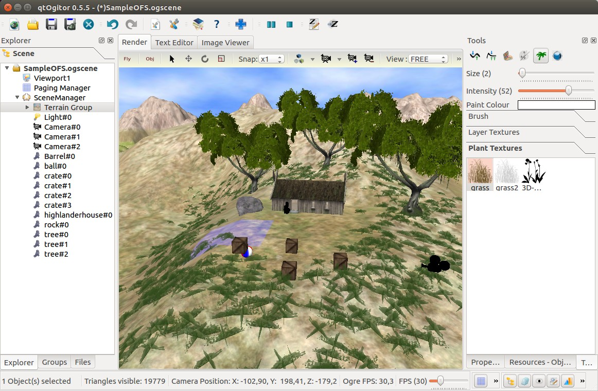

<p align="center"></p>

_This is the repository for Ogitor SceneBuilder, the WYSIWYG scene editing environment for OGRE_

<p align="center"></p>

## Fetching updates
Please note that some of Dependencies are in submodules. Do not forget to update them before build.

## Building OGITOR

By default, the build script will download and install the media and projects archives, so you don't have to worry about getting them yourself.
You can choose not to by setting `OGITOR_DOWNLOAD_SAMPLEMEDIA` and `OGITOR_DOWNLOAD_SAMPLEPROJECT` to FALSE when configuring the project with CMake.

**Note:** you must do the install (as in `make install`) step for ogitor to find the plugins. In doubt uncheck the `OGITOR_DIST` cmake option.

## Running OGITOR

To be able to run Ogitor, you will need the media.zip archive downloaded and extracted into the OGITOR ```"RunPath"``` folder. The projects.zip archive is optional but advised, since it offers a sample scene to get you started. Both archives can be downloaded under the following links:

* [https://bitbucket.org/ogitor/ogitor/downloads/media.zip](https://bitbucket.org/ogitor/ogitor/downloads/media.zip)
* [https://bitbucket.org/ogitor/ogitor/downloads/projects.zip](https://bitbucket.org/ogitor/ogitor/downloads/projects.zip)

# Links

* [Mercurial repository](https://bitbucket.org/ogitor/ogitor)
* [google.com/+OgitorOrg](https://www.google.com/+OgitorOrg)
* [@ogitors](https://twitter.com/ogitors)
